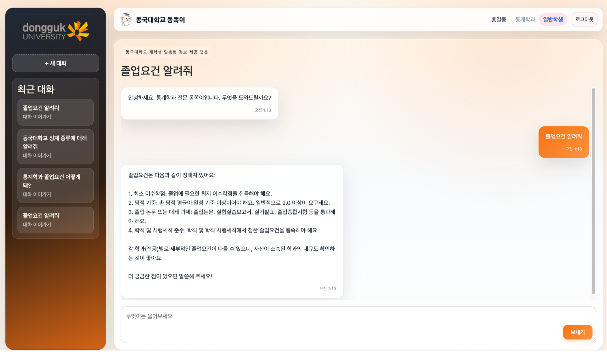
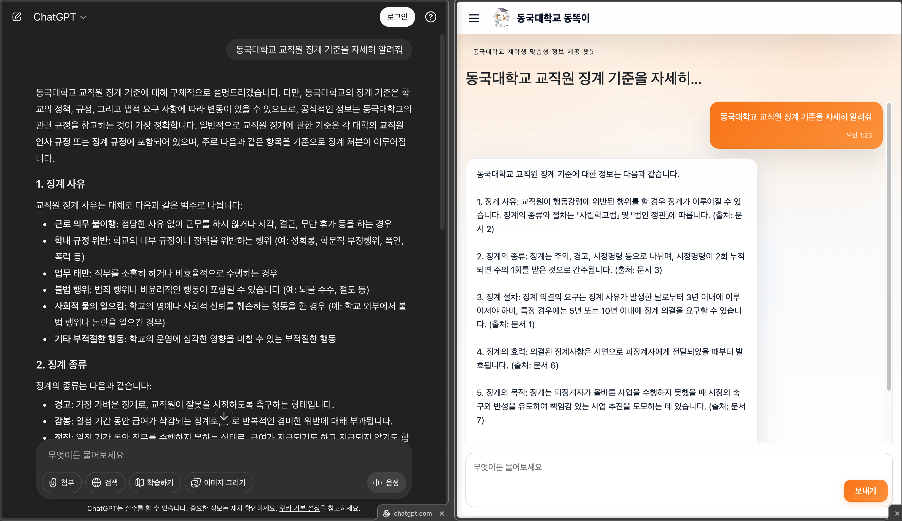
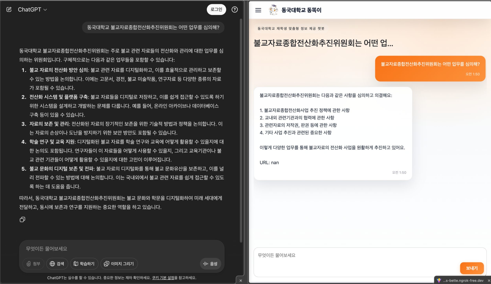
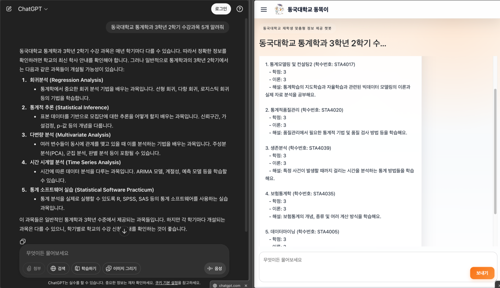

# A3.1 OSS 프로젝트 최종보고서

* [I. 수행팀 개요](#i-프로젝트-수행팀-개요)
* [II. 수행 결과](#ii-프로젝트-수행-결과)
  * [1. 프로젝트 개요](#1-프로젝트-개요)
    * [1.1 개발 동기 및 목적](#11-개발-동기-및-목적)
    * [1.2 필요성 및 차별점](#12-필요성-및-차별점)
    * [1.3 개발 목표](#13-개발-목표)
  * [2. 최종결과물 소개](#2-최종결과물-소개)
  * [3. 프로젝트 추진 내용](#3-프로젝트-추진-내용)
     * [3.1 프로젝트 진행과정](#31-프로젝트-진행과정)
     * [3.2 프로젝트 구현과정](#32-프로젝트-구현과정-시스템-아키텍처)
  * [4. 기대효과](#4-기대효과)
  * [5. 역할분담](#5-역할분담)
  * [6. 참고문헌](#6-참고문헌)

## I. 프로젝트 수행팀 개요

* **수행 학기:** 2025년 2학기 (2025.09 ~ 2025.12)
* **프로젝트명:** 동국대학교 재학생 맞춤형 정보 제공 챗봇 시스템 '동똑이'
* **Key Words:** #RAG #Chatbot #LLM #huggingface #내규
* **팀명:** Renux

| 구분 | 성명 | 학번 | 소속학과 | 연계전공 | 이메일 |
|:---:|:---:|:---:|:---:|:---:|:---:|
| 팀장 | 조준용 | 2020111242 | 경찰행정학부 | 융합소프트웨어 | junyong4510@gmail.com |
| 팀원 | 신원철 | 2021110445 | 통계학과 | 융합소프트웨어 | swc3466@naver.com |
| 팀원 | 육심호 | 2021110473 | 통계학과 | 융합소프트웨어 | 6aimho@gmail.com |

* **지도교수:** 융합소프트웨어 연계전공 이길섭 교수

## II. 프로젝트 수행 결과

### 1. 프로젝트 개요

#### 1.1 개발 동기 및 목적
* **개발 동기:** 현재 동국대학교 챗봇 서비스는 템플릿 기반의 응답 구조로, 정해진 질문 외의 복합적인 맥락을 요구하는 문의에는 적절한 답변을 제공하지 못하는 한계가 있습니다. 또한, 링크 제공 방식의 답변은 사용자가 추가 탐색을 해야 하는 불편함이 있으며, 연결된 정보가 일치하지 않는 경우도 빈번합니다.
* **목적:** LLM과 RAG 기술을 도입하여 환각 현상 없이 정확한 정보를 제공하고, 사용자가 추가 탐색 없이 필요한 정보를 즉시 확인할 수 있는 지능형 맞춤 정보 제공 챗봇 서비스 '동똑이'를 개발합니다.

#### 1.2 필요성 및 차별점
* **유연한 자연어 이해:** 사전에 정해진 질문 형식을 벗어나 사용자의 의도를 파악하는 AI 시스템 도입이 시급합니다.
* **정보의 최신성 보장:** 학교 홈페이지의 공지사항을 1일 4회 자동 크롤링하여 최신 데이터 기반의 답변을 제공합니다.
* **데이터 사각지대 해소:** 웹 크롤링이 불가능한 '학칙 및 규정' 파일의 텍스트를 추출하는 전처리 엔진을 개발하여, 내규 정보까지 대화를 통해 습득할 수 있도록 합니다.

#### 1.3 개발 목표
* **Advanced RAG 검색 구현:** LLM Router를 통해 질문 의도를 분석하고, Hybrid Search와 Re-ranking 과정을 거쳐 검색 정확도를 극대화합니다.
* **신뢰성 있는 답변 생성:** 답변 생성 시 반드시 정보의 출처를 명시하도록 프롬프트를 최적화하여 행정 정보의 신뢰성을 확보합니다.
* **연속 대화 지원:** 이전 대화 맥락을 기억하는 멀티턴 기능을 구현하여 자연스러운 사용자 경험을 제공합니다.

### 2. 최종결과물 소개

* **Renux RAG 챗봇 시스템 (동똑이)**
    * **기능:** 동국대학교 공지사항, 내규, 전화번호부, 전공 과목, 학사일정에 대한 질문에 대해 신뢰도 높은 답변 제공.
    * **사용자 경험:** 회원가입/로그인 시 이전 대화 내역이 저장되며, 게스트 모드에서도 채팅 기능 지원 (단, 새로고침 시 내역 초기화).
    * **환각 현상 개선:** 기존 GPT 모델이 모르는 정보를 지어내는 것과 달리, '동똑이'는 정확한 출처와 근거를 기반으로 답변.

### 3. 프로젝트 추진 내용

#### 3.1 프로젝트 진행과정
* **아이디어 및 기획:** 단순 키워드 검색을 넘어 자연어 질문에 출처와 함께 답변하는 서비스 기획.
* **데이터 구축:** * 학교 공지사항, 학사 일정 크롤러 개발.
    * **자체 개발 전처리 엔진:** 접근이 어려운 내규 파일 텍스트 추출 및 정제.
    * ChromaDB에 벡터 데이터 구축 및 학과별/날짜별 메타데이터 태깅.
* **AI 엔진 고도화:**
    * **LLM Router:** 질문 의도에 따라 검색 카테고리 자동 분류.
    * **Hybrid Search:** 한국어 특화 임베딩(KURE-v1) + 키워드 매칭(TF-IDF) 결합.
    * **Re-ranking:** 최신성 가중치 알고리즘을 적용하여 시의적절한 정보 우선 노출.
* **서비스 통합:** Python(AI) - C#(Backend) - React(Frontend) 마이크로서비스 아키텍처 구축.

#### 3.2 프로젝트 구현과정 (시스템 아키텍처)

**1. 기술 스택**
* **Frontend:** React (Vite, TypeScript)
* **Backend:** ASP.NET Core 9.0 (User Auth, Chat Session, DB Connection)
* **LLM Server:** FastAPI (RAG Engine)
* **Database:** PostgreSQL (Data Entity), ChromaDB (Vector Store), Redis (Cache)
* **AI Model:** OpenAI GPT-4o-mini (Generation), KURE-v1 (Embedding)

**2. 핵심 파이프라인 (RAG Engine)**
1.  **데이터 수집/전처리:** Selenium/BeautifulSoup 크롤링 및 HWP 텍스트 추출 -> 청킹(Chunking) -> 메타데이터 태깅.
2.  **임베딩:** KURE-v1 모델을 사용하여 텍스트를 고차원 벡터로 변환 및 인덱싱.
3.  **검색(Retrieval):** LLM Router로 의도 파악 -> Dense(Vector) + Sparse(TF-IDF) 하이브리드 검색.
4.  **재순위화(Reranking):** 벡터 점수, 키워드 점수, 최신성 가중치를 결합하여 문서 재정렬.
5.  **생성(Generation):** 검색된 청크와 제약 조건(출처 표기 등)을 프롬프트에 주입하여 답변 생성.

### 4. 기대효과

1.  **스마트 캠퍼스 이미지 강화:** 최신 생성형 AI(RAG) 기술을 학사 행정에 선제적으로 도입하여 디지털 혁신 선도 대학 이미지 제고.
2.  **학사 운영의 투명성 및 신뢰도 향상:** AI가 규정 원문에 근거하여 답변하므로 규정 해석의 모호함을 줄이고 투명성 확보.
3.  **리소스 낭비 감소 (ESG):** 종이 문서나 안내 책자 대신 AI를 통해 정보를 제공함으로써 예산 절감 및 ESG 경영 실천.
4.  **정보 불균형 해소:** 인맥이나 정보력에 상관없이 누구나 공평하게 정확한 학사 정보를 얻을 수 있어 정보 격차 해소.

### 5. 역할분담

| 구분 | 성명 | 역할 |
|:---:|:---:|:---|
| 팀장 | 조준용 | 백엔드 서버(ASP.NET Core) 구현, DB 설계 및 구축 |
| 팀원 | 신원철 | RAG 모델 및 LLM 답변 파이프라인 개발, FastAPI 서비스 구현, 데이터 크롤링 |
| 팀원 | 육심호 | 웹 프론트엔드(React) UI/UX 개발, 컴포넌트 설계 및 구현 |

### 6. 참고문헌

1. 패스트캠퍼스 with 테디노트, *테디노트의 RAG 비법노트 : RAG 시작하기*, wikidocs, https://wikidocs.net/book/16865
2. Cem Dilmegani with Ekrem Sari, *RAG Frameworks: LangChain vs LangGraph vs LlamaIndex vs Haystack vs DSPy*, AIMultiple, https://research.aimultiple.com/rag-frameworks/
3. 고려대학교 NLP&AI 연구실과 HIAI 연구소, *KURE : Korea University Retrieval Embedding model*, Human Inspired AI Research, https://hiai.korea.ac.kr/kure/
4. 팍스, *React 리액트 마스터: 모바일과 웹 사용자 인터페이스 개발을 위한 최고의 라이브러리*, wikidocs, https://wikidocs.net/book/10082

### 7. 프로젝트 성과

* **Github 등록:** 동국대학교 AI 챗봇 서비스 '동똑이'의 프론트엔드, 백엔드, AI 모델 코드 공개 (2025년 12월).
