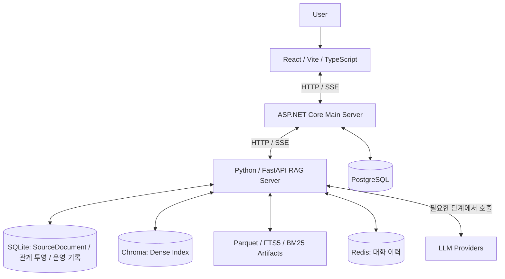

# Dongttok Architecture

기준일: 2026-09-27 · 코드 기준: `4b62d12`

이 문서는 현재 저장소의 구현과 코드 기본 설정을 설명한다. 실제 배포 환경의
설정, 데이터 신선도, 인덱스 정합성 및 운영 활성화 여부는 배포 후보에서 별도로
확인해야 한다. 답변 정책의 기준은
[Answer Contract](../src/RAG/docs/answer-contract-v1.md)다.

## 1. Service Overview

동똑이는 동국대학교 공식 자료를 기반으로 학생의 질문에 답변하고 원문 출처를
제공하는 RAG 서비스다. 공지, 규정, 학사일정, 교과목, 교직원 연락처, 학식을
검색하며, 일정·학식처럼 정형 자료로 답할 수 있는 질문에는 결정적 직접 응답을
사용한다.

핵심 원칙:

- 학교 관련 사실은 공식 자료에서 확인된 내용만 답변한다.
- 최신성은 게시일뿐 아니라 수집 시점, 적용기간, 학년도·학기, 마감일로 판단한다.
- 답변 근거의 문서·청크 식별자, 원문 URL 및 출처 메타데이터를 보존한다.
- 근거가 부족하거나 질문 조건이 불명확하면 추측하지 않는다.
- 일반 규정 안내와 개인 학적정보가 필요한 판정을 구분한다.

현재 제품 범위는 서울캠퍼스·바이오메디캠퍼스 및 공통 자료다. WISE캠퍼스는
명시적으로 범위 밖 처리하며, 캠퍼스가 불명확한 자료를 서울 자료로 추정하지 않는다.

## 2. System Architecture



| 구성요소 | 역할 |
|---|---|
| Frontend | 질문 입력, SSE 답변 표시, 출처·후속질문·피드백 UI. 같은 웹 프런트를 Capacitor iOS 앱에서도 사용한다. |
| ASP.NET Core | 인증·권한, 사용자·학과 정보, 대화 및 답변 버전 저장, RAG 요청 중계와 SSE 완료 이벤트 처리. |
| FastAPI | 직접 응답, 질의 분석, 결정적 라우팅, 조건 필터, 검색·근거 선택·답변 생성·사후 근거성 검사. |
| PostgreSQL | 메인 서버의 사용자·조직·대화·출처 메타데이터·제품 이벤트 등 서비스 데이터. |
| SQLite | RAG의 `SourceDocument` 정본, 데이터셋별 테이블, 온톨로지 투영, 수집·평가·피드백 기록. 기본 파일은 `src/RAG/rag_database.db`이며 `RAG_DATABASE_FILE`로 변경한다. |
| Chroma | 청크 임베딩과 메타데이터를 저장하는 dense 검색 인덱스. |
| Parquet / FTS5 / BM25 | 검색 청크 및 lexical 인덱스. FTS5도 SQLite 파일을 사용하지만 정본 DB와 별도인 파생 인덱스다. |
| Redis | TTL을 적용할 수 있는 RAG 대화 이력. 연결 실패 시 메모리 이력으로 대체하며, PostgreSQL의 대화 저장과 역할이 다르다. |

답변 생성은 LangChain 인터페이스를 통해 `LLM_PROVIDER=openai` 또는 `ollama`를
선택한다. 질의 분석·근거 선택·근거성 검사는 별도의 OpenAI 역할별 모델 설정을
사용한다. 라우터는 코드 규칙으로 동작하며 라우팅 자체에 LLM을 호출하지 않는다.
직접 응답은 답변 생성 LLM을 호출하지 않는다.

주요 구현: [메인 서버](../src/RenuxServer/Program.cs),
[채팅 중계](../src/RenuxServer/Apis/Chat/ChatRequestApis.cs),
[RAG API](../src/RAG/api/rag_service.py),
[RAG 저장소](../src/RAG/src/database.py),
[생성·이력 관리](../src/RAG/src/services/langchain_chat.py).

## 3. RAG Pipeline

```text
질문 + 사용자 학과/대화 이력 + 요청 기준시점(as_of)
  → 제품 범위·캠퍼스·위기 대응 등 선행 분기
  → 정형 직접 응답 / 과목 추천 / 추가 조건 질문
  → 필요한 경우 질의 의도·조건 분석
  → 결정적 라우팅 및 스트리밍·비스트리밍 공통 검색 계획
  → SQL 관계 근거 우선 조회 또는 Dense + Lexical 검색
  → 메타데이터·날짜·대상자·공개 범위 필터 및 결과 결합
  → 제목·키워드·시점·문서별 후보 정렬과 shortlist 구성
  → 선택적 cross-encoder 재정렬
  → 답변 가능성 확인 및 근거 선택
  → 선택된 문서의 이웃 청크로 Parent Context 보강
  → LLM 답변 생성
  → 생성 답변의 Grounding 검사 및 실패 정책 적용
  → 답변·출처·완료 메타데이터 반환 및 로그 저장
```

위 흐름은 주요 단계를 요약한 것이다. 조건 필터는 검색 전·후에 모두 적용할 수
있고, 직접 응답이나 근거 부족 안내에서 종료되는 요청은 생성 단계까지 가지 않는다.

### Retrieval Paths

- **직접 응답**: 일정·학식 등의 정형 자료에서 답변과 출처를 구성한다. 현재
  날짜에 민감한 일정·학식 질문은 수집 신선도가 `healthy`일 때만 직접 답한다.
  신선도 검사 실패, 오래된 자료, 반복 수집 실패는 확인 안내로 처리한다.
- **구조형 검색**: 단일 데이터셋으로 범위가 좁혀진 연락처, 교과목 코드·개설학과,
  학번별 졸업·교양 기준 질문은 SQLite 온톨로지의 관계와 연결된 정본 근거를 먼저
  조회한다. 투영 revision이 오래되었거나 근거가 없거나 필터로 모두 제외되면 기존
  hybrid 검색으로 돌아간다. 일반·복합 질문 전체를 SQL 검색으로 전환하지 않는다.
- **Hybrid 검색**: Chroma dense 검색과 lexical 검색을 수행하고 기본적으로 RRF로
  결합한다. Lexical 기본 백엔드는 FTS5이며 인덱스 부재 시 BM25 pickle로 대체하고,
  이전 TF-IDF 아티팩트도 호환 경로로 읽는다. Dense 장애 시 가능한 lexical 검색을
  계속 수행하되 readiness에 인덱스 문제를 표시한다.
- **Ontology 후보 보강**: 일반 shortlist에 관계 후보를 추가하는 별도 선택 기능이다.
  현재 허용 데이터셋은 `rules`, `schedule`, `notices`이며 문서·슬롯·탐색 깊이 상한과
  기존 조건 필터를 적용한다. 구조형 SQL 경로와 활성화 플래그가 다르다.

### Code Defaults

다음은 [config.py](../src/RAG/src/config.py)의 기본값이다. 환경변수가 우선하며
실제 운영 설정을 증명하는 값은 아니다.

| 설정 | 기본값 | 의미 |
|---|---|---|
| `RAG_STRUCTURED_RETRIEVAL_ENABLED` | `1` | 범위가 명확한 관계형 질문의 SQL 근거 우선 경로. |
| `RAG_ONTOLOGY_SHADOW_ENABLED` | `0` | 별도의 shadow 비교·관측 경로. |
| `RAG_ONTOLOGY_CANDIDATES_ENABLED` | `0` | 일반 검색 shortlist에 관계 후보를 제한적으로 추가. |
| `RERANKER_ENABLED` | `0` | Cross-encoder 재정렬. 코드 기반 후보 정렬과 구분한다. |
| `PARENT_CONTEXT_ENABLED` | `1` | 선택된 근거와 같은 문서의 이웃 청크 확장. |
| `RAG_HONOR_SELECTOR_REFUSAL` | `1` | 근거 선택기가 근거 부족으로 거절하면 생성으로 넘기지 않음. |
| `RAG_GROUNDING_CHECK_ENABLED` | `1` | 생성 답변의 사후 근거성 검사. |
| `RAG_GROUNDING_FAILURE_POLICY` | `replace` | 비스트리밍 또는 아직 전송하지 않은 답변의 검증 실패 시 확인 안내로 대체. |
| `RAG_STREAM_BUFFER_UNTIL_GROUNDED` | `0` | 기본 스트림은 토큰을 먼저 전송. 검증 실패 시 이미 보낸 토큰을 회수할 수 없어 정정 안내를 추가. |
| `RAG_SEMANTIC_CACHE_ENABLED` | `0` | 인프로세스 의미 기반 답변 캐시. Redis 대화 이력과 별도 기능. |

버퍼 스트리밍을 활성화하면 생성·검사가 끝난 후 텍스트를 전송한다. 일반 답변의
Grounding은 생성 전 검색 필터나 근거 선택과 별도인 **생성 후 검사**다.
후속질문은 본 응답 완료 후 `/followups`로 요청할 수 있다.

주요 구현: [검색 전략](../src/RAG/src/services/retrieval_strategy.py),
[Hybrid 검색](../src/RAG/src/search/hybrid.py),
[관계 검색](../src/RAG/src/services/ontology_retrieval.py),
[근거 선택](../src/RAG/src/services/evidence_selector.py),
[근거성 검사](../src/RAG/src/services/grounding.py).

## 4. Data Pipeline

```text
동국대학교 공식 자료 / 승인된 관리 입력
  → Crawling / Parsing
  → HTML·HWP·PDF 본문 추출 및 필요한 공지 이미지 전사문 결합
  → Cleaning / Normalization / 원천 구조 fingerprint 기록
  → SourceDocument 정본 및 데이터셋별 테이블 갱신
  → 안정적인 document_key·chunk_id와 검색 메타데이터 생성
  → Chunking 및 corpus_revision 계산·기록
  → Parquet / Lexical Index / Embedding / Chroma 생성·갱신
  → 정본-파생 인덱스 lineage 검사
  → 대상 데이터셋의 revision-bound ontology 투영 갱신
  → 수집 상태·진단·신선도 기록 및 런타임 상태 갱신
```

본문·첨부파일·이미지 전사문은 원문 URL과 원천 식별자를 유지한다. OCR 전사문은
공식 원문의 검색 표현을 보강하는 자료이며 독립적인 공식 판단 근거가 아니다.

스케줄러는 `notices`, `rules`, `schedule`, `courses`, `staff`, `meals`의 갱신을
관리한다. 공지의 실패 게시판은 제한적으로 재시도하고, 교직원 변경은 검수 대기
스냅샷을 승인한 후 반영한다. 수집 실행 기록에는 상태, 건수, `outcome_code`, 진단,
`corpus_revision`을 남겨 원천 비어 있음·부분 수집·구조 변경·색인 실패를 구분한다.

수집 후 파생 DAG는 해당 데이터셋의 lineage를 먼저 확인하고 통과한 경우 온톨로지
투영을 갱신한다. 온톨로지 대상은 `courses`, `notices`, `rules`, `schedule`, `staff`이며
`meals`는 제외한다. 파생 단계 실패는 수집 기록에도 반영한다.

주요 구현: [정본 저장](../src/RAG/src/pipelines/canonical.py),
[수집·색인](../src/RAG/src/pipelines/ingest.py),
[공지 동기화](../src/RAG/src/pipelines/notices_sync.py),
[스케줄러](../src/RAG/src/services/scheduler.py),
[파생 DAG](../src/RAG/src/services/derivative_dag.py),
[원천 구조 검사](../src/RAG/src/services/source_schema.py).

## 5. Source of Truth

RAG의 정본은 SQLite의 `SourceDocument`다. `document_key`를 문서 identity로
사용하고 원문 URL, 원천 ID, 상태, 내용 hash, 원본·정규화 payload 및 수집 시점을
보존한다. PostgreSQL의 서비스 데이터와 저장소·책임이 다르다.

Parquet, Chroma, FTS5/BM25 및 온톨로지는 정본을 기반으로 재생성 가능한 파생
데이터다. 검색 청크의 `doc_id`와 온톨로지 evidence는 정본 `document_key`에 연결된다.

필수 lineage 불변식:

1. 게시 가능한 `active`·`updated` 정본의 `document_key` 집합과 Parquet의 문서 ID
   집합이 정확히 일치한다.
2. Parquet의 `chunk_id` 집합과 Chroma의 청크 ID 집합이 정확히 일치한다.
3. 같은 청크의 Chroma `metadata.doc_id`와 Parquet 부모 문서 ID가 일치한다.
4. 정본·문서·청크 식별자의 공백·중복·고아 관계 및 비어 있는 필수 계층을 허용하지 않는다.

서버 시작 및 런타임 갱신에서 이 검사를 수행한다. 불일치하거나 검사가 실패하면
`/ready`는 HTTP 503을 반환한다. `/health`는 프로세스 생존 확인이며 데이터
정합성·신선도·검색 품질을 보장하지 않는다. 운영 트래픽 차단은 배포 환경이
`/ready` 결과를 사용하도록 구성해야 한다.

`corpus_revision`은 검색에 영향을 주는 데이터셋 내용과 메타데이터의 세대를
식별한다. 청크와 lexical 아티팩트의 revision을 대조하고, 온톨로지 build는 연결된
corpus revision과 별칭 파일 등을 기준으로 현재 세대인지 검사한다. 단순히 ID가
같다는 이유로 오래된 관계 근거를 재사용하지 않는다.

신선도는 필수 readiness와 별도로 노출한다. 일부 데이터셋의 신선도 경고만으로
전체 API를 중단하지 않지만, 현재 시점의 일정·학식 직접 응답은 오래되거나 반복
실패한 자료로 확정 답변하지 않는다.

주요 구현: [Lineage Runbook](../src/RAG/docs/canonical-lineage-runbook.md),
[lineage 검사](../src/RAG/src/services/canonical_lineage.py),
[corpus revision](../src/RAG/src/services/corpus_revision.py),
[온톨로지 build](../src/RAG/src/services/ontology_build.py),
[신선도 검사](../src/RAG/src/services/ingestion_freshness.py).

## 6. Retrieval Signals

| 신호 | 사용 목적 |
|---|---|
| Vector similarity | 의미적으로 관련 있는 dense 검색 후보 조회. |
| FTS5/BM25 lexical score, keyword overlap | 과목 코드·부서명·규정 용어 등 어휘 일치 및 SQL 범위 내부 청크 정렬. |
| Title overlap | 질문의 핵심 주제와 제목의 일치도 반영. |
| Department / college | 학과·단과대 적용 범위 및 학과 전용 공지 공개 범위 확인. |
| Campus / target user | 캠퍼스·학부/대학원·대상자 경계 적용. |
| Academic year / semester / entry cohort | 학년도·학기·학번에 맞는 규정과 일정 선택. |
| Effective date / deadline / recency | 요청 `as_of`와 적용기간·마감일·게시일을 함께 사용. |
| Active status / visibility | 비활성·삭제·비공개 자료 및 부적합한 공지 제외. |
| Canonical relation evidence / corpus revision | 관계 후보의 정본 연결과 현재 세대 확인. |

범위·권한·날짜 조건은 단순 점수 가산으로 대체하지 않는다. 최신 게시물이라도
질문의 학번·학기·대상자와 맞지 않으면 우선할 수 없다. RRF 점수는 순위 결합
신호이며 답변 정확도나 공식 자료의 신뢰 확률이 아니다.

## 7. Failure Policy

[Answer Contract](../src/RAG/docs/answer-contract-v1.md)의 정책 상태를 구분한다.

| 상태 | 처리 원칙 |
|---|---|
| `answerable` | 질문을 직접 뒷받침하는 공식 근거로 답변하고 출처 제공. |
| `partially_answerable` | 확인된 부분만 답변하고 미확인 부분 표시. |
| `needs_clarification` | 캠퍼스·학과·학번·학기 등 필요한 조건 요청. |
| `not_answerable` | 공식 자료에서 확인되지 않음을 안내하고 추측하지 않음. |
| `conflicting_sources` | 적용 가능한 공식 자료 간 충돌과 각각의 출처 표시. |
| `personal_data_unavailable` | 일반 기준만 안내하고 개인 학적정보가 필요한 확정 판정은 수행하지 않음. |
| `out_of_domain` | 학교 밖 질문·WISE 등 지원 범위 밖 요청 안내. |
| `service_unavailable` | 검색·인덱스·모델 장애와 재시도 안내. 근거 없음과 구분. |

현재 API는 이 정책 상태 전체를 하나의 `answer_state` enum으로 반환하지 않는다.
`fallback_reason`, `grounded`, 출처 및 추가 조건 안내 등으로 부분 표현한다.
주요 검색 실패 사유는 `no_results`, `dataset_unavailable`, `score_below_threshold`,
`date_filter_eliminated_all`, `active_deadline_filter_eliminated_all`, `campus_out_of_scope`다.

근거 선택기가 적절한 근거를 찾지 못하면 기본적으로 생성을 중단한다. 생성 후
검증에서 근거성이 부족하면 설정에 따라 확인 안내로 대체하거나 정정 안내를
덧붙인다. 검사를 실행하지 않았거나 오류가 발생한 `grounded=null`은 검증 성공이
아니다. 현재 구현은 검사 예외 시 생성 답변을 반드시 차단하지 않으므로, 엄격한
전송 전 차단을 운영 보장으로 주장하려면 별도 검증·보완이 필요하다.

문서 수집·검색 회귀 테스트와 구조형 qrels는 정합성·검색 계약을 검증한다. 이를
사람이 판정한 관련성, 실제 endpoint의 답변 품질 또는 운영 준비 완료와 동일하게
취급하지 않는다.

## 8. Deployment Safety

Agent는 작업마다 전용 branch와 worktree(`../dongttok-worktrees/<slug>`)를 사용하고
기존 변경을 보존한다. branch 이름, worktree 생성·제거, 역할 분담, 완료 보고 형식은
[AGENTS.md](../AGENTS.md)와 [CLAUDE.md](../CLAUDE.md)를 따른다. 전체 Human Approval Gate
목록은 AGENTS.md에 있으며, 다음 작업은 사람의 명시적 승인 없이 수행하지 않는다.

- Production deployment 및 운영 트래픽 전환.
- Production DB 변경·재색인·원천 데이터 일괄 반영.
- 운영 Secret 변경·교체 및 인증 설정 변경.
- Main branch merge.

main 직접 변경은 금지하며 작업 branch의 worktree에서 수정한다.
파괴적인 DB 작업과 destructive migration은 현재
[AGENTS.md](../AGENTS.md)의 금지 규칙을 따른다. 승인 없는 실행은 물론,
일반적인 기능 작업의 일부로 삭제·초기화·파괴적 migration을 수행하지 않는다.
Secret, 개인 데이터가 포함된 DB dump 및 로컬 인증서·키 파일은 커밋하지 않는다.

검색 경로·임베딩·청킹·필터·재정렬 변경은 관련 회귀 테스트, 정본-파생 lineage,
동일 qrels/골든셋 비교를 거친다. 실제 후보 endpoint의 답변·출처·완료 이벤트까지
확인하며, 로컬 테스트 통과와 운영 배포 완료를 구분한다. 현재 골든 CI는 후보
URL이 없으면 검증을 건너뛰므로 CI 성공만으로 실제 후보 검증을 주장하지 않는다.

운영 전환 시 DB·아티팩트 복구 지점, 인덱스 포인터 및 기능별 플래그 복귀 방법을
확인한다. Cross-encoder, 광범위한 온톨로지 후보 보강, 의미 캐시는 기본 비활성
상태에서 사람 관련성 판정과 품질·지연·비용 검증을 통과한 범위만 활성화한다.

관련 문서: [파이프라인 점검·개선 계획](../src/RAG/docs/pipeline-audit/README.md),
[온톨로지 구현 계획](../src/RAG/docs/ontology-implementation-plan.md),
[CI](../.github/workflows/ci.yml),
[실제 후보 골든 검증](../.github/workflows/rag-golden-release.yml).
