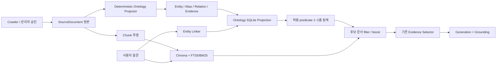

# 동똑 온톨로지·관계 검색 적용안

- 문서 상태: 구현 진행 중
- 온톨로지 스키마 버전: `4`
- 최초 작성: 2026-08-27
- 적용 원칙: `SourceDocument` 정본을 유지하고 온톨로지는 재생성 가능한 검색 투영으로 운영

## 1. 결론

동똑의 공지·규정·학사일정·교과목·교직원·학식 데이터에는 이미 관계 검색에
필요한 구조가 상당 부분 존재한다. 다만 관계가 데이터 필드, 별칭 CSV, 검색 필터,
서비스 코드에 흩어져 있어 데이터셋을 넘어 일관되게 탐색하기 어렵다.

동똑에는 기존 RAG를 전면 교체하는 방식보다 다음 구성이 적합하다.

> 경량 도메인 온톨로지 + 근거가 연결된 지식 그래프 + 기존 Chroma/FTS5/BM25 하이브리드 검색

온톨로지는 용어와 허용 관계를 정의하고, 지식 그래프는 실제 정본 데이터에서
생성한 엔터티·관계 인스턴스를 저장한다. 그래프는 답변의 독립 근거가 아니며,
모든 관계 주장은 원래 `SourceDocument.document_key`와 retrieval-affecting 필드
위치를 통해 원문으로 돌아갈 수 있어야 한다.

## 2. 목표와 비목표

### 목표

1. 학과명 하나로 단과대·교과목·규정·담당부서·연락처 후보를 연결한다.
2. 여러 데이터셋에 흩어진 학과·단과대·부서 별칭을 canonical entity로 통합한다.
3. 관계를 이용해 기존 하이브리드 검색의 후보를 좁히거나 1~2홉 확장한다.
4. 모든 관계에 출처, 증거 필드, 기준 시점, 생성 방법과 검수 상태를 보존한다.
5. 기존 검색 대비 Recall@K, MRR, nDCG와 grounding 품질 개선을 측정한다.

### 비목표

1. 온톨로지 그래프를 새로운 정본 DB로 만들지 않는다.
2. 첫 단계에서 Chroma, FTS5/BM25 또는 기존 evidence selector를 대체하지 않는다.
3. 원천 데이터에 없는 선수과목, 강의실, 건물 거리, 실제 개설 여부를 추론하지 않는다.
4. LLM이 만든 자유 형식 관계를 검수 없이 검색에 게시하지 않는다.
5. 첫 단계에서 Neo4j, RDF triple store 또는 Microsoft GraphRAG 전체 파이프라인을 도입하지 않는다.

## 3. 현재 데이터와 적용 우선순위

2026-08-26 로컬 정본 DB 점검 결과를 기준으로 한 초기 판단이다. 이는 배포 서비스나
원천 사이트의 실시간 최신성을 증명하지 않는다.

| 데이터셋 | 현재 관계 단서 | 적용성 | 첫 적용 범위 |
|---|---|---:|---|
| `courses` | 단과대, 학과, 학수번호, 과목명, 학년, 학기 | 매우 높음 | 자동 승인 |
| `staff` | 조직 트리, 부서 경로, 성명, 직위, 담당업무, 연락처 | 매우 높음 | 자동 승인 |
| `rules` | 일부 단과대, 입학연도, section, source version | 중간~높음 | 2단계 |
| `schedule` | 기간, category, 담당부서 | 높음 | 명시 일정·기간·담당부서 자동 승인 |
| `notices` | 게시판·날짜와 제목 앞 `[조직]` 표기 | 중간 | 유일 조직 표기만 자동 승인, 대상 추론은 검수 |
| `meals` | 날짜, 식당, 메뉴 | 낮음~중간 | 캠퍼스·시설 원천 확보 후 |

## 4. 정본과 파생 계보



정본과 파생물의 책임은 다음과 같이 구분한다.

| 계층 | 역할 | 삭제 후 재생성 |
|---|---|---:|
| `SourceDocument` | 수집 정본, identity, 상태, normalized payload | 아니오 |
| `Chunk`, Parquet, Chroma, FTS5/BM25 | 텍스트 검색 투영 | 가능 |
| `ontology_*` | 관계 검색 투영과 provenance | 가능 |
| 답변/검색 로그 | 평가·운영 관측 | 별도 보존 정책 |

### 4.1 과거 graph 잔재와 마이그레이션 경계

2026-08-27 로컬 `rag_database.db`에는 현재 SQLAlchemy 모델과 검색 코드가
참조하지 않는 과거 테이블이 남아 있는 것이 확인됐다.

| legacy table | 행 수 | 확인된 문제 |
|---|---:|---|
| `entities` | 8,838 | source document provenance와 lifecycle contract 없음 |
| `entity_relations` | 13,176 | exact edge는 7,775개, 중복 relation 5,401행 |

특히 `HAS_DEPARTMENT`는 4,401행이지만 고유한 subject-predicate-object edge는
71개뿐이고, 동일 관계가 교과목 행마다 반복돼 있다. 반면 이 테이블을 현재 검색
경로에서 읽는 코드는 발견되지 않았다.

Phase 1은 legacy table을 읽거나 수정하거나 삭제하지 않는다. 새 `ontology_*`
projection이 provenance·deduplication·lifecycle 검증을 통과하고 shadow retrieval에서
효과가 확인된 뒤에만 별도의 승인된 정리 절차를 만든다. `build_ontology.py`는
legacy graph의 존재와 행 수를 preflight 결과에 표시하고 `preserved_not_read_or_modified`
정책을 명시한다.

## 5. 온톨로지 v0.1

### 5.1 현재 구현 엔터티

| 타입 | 의미 | canonical identity |
|---|---|---|
| `College` | 단과대학 | 정규화한 공식 단과대명 |
| `Department` | 학과·학부·전공 | 검수된 별칭 적용 후 공식 명칭 |
| `OrganizationUnit` | 행정부서 및 조직 트리 노드 | 전체 부서 경로 기반 ID |
| `Course` | 교과과정 과목 | 학과 + 학수번호/과목명 기반 ID |
| `Person` | 공개 교직원 명부 행 | `SourceDocument.document_key` 기반 ID |
| `AcademicRequirement` | 학번별 졸업·교양 이수 기준 문서 | `SourceDocument.document_key` 기반 ID |
| `EntryCohort` | 입학 학번 집단 | `YYYY학번` |
| `AcademicEvent` | 학사일정의 개별 행사 | `SourceDocument.document_key` 기반 ID |
| `DateRange` | 일정 시작일·종료일 | ISO 날짜 쌍 |
| `Notice` | 조직 표기가 안전하게 해석된 공지 | `SourceDocument.document_key` 기반 ID |

### 5.2 현재 구현 관계

| predicate | subject → object | 자동 게시 조건 |
|---|---|---|
| `PART_OF` | 학과→단과대, 조직→상위조직 | 정형 학과/단과대 필드 또는 부서 경로 |
| `OFFERED_BY` | 과목→학과 | 정형 교과목 행 |
| `WORKS_AT` | 교직원→조직/학과 | 정형 교직원 명부 행 |
| `GOVERNS` | 학업요건 문서→단과대/학과 | 학업이수가이드의 단과대·소속학과 메타데이터 |
| `VALID_FOR_ENTRY` | 학업요건 문서→입학 학번 | 학업이수가이드의 명시적 `entry_year` |
| `OCCURS_DURING` | 학사행사→기간 | 정형 `start_date`, `end_date` |
| `MANAGED_BY` | 학사행사→담당조직 | 일반 범위가 아닌 명시적 담당부서 |
| `MENTIONS_ORGANIZATION` | 공지→조직/학과 | 제목 앞 `[조직]` 또는 `department`가 기존 조직 하나와 정확히 일치 |

### 5.3 후속 후보 관계

| predicate | 예시 | 선행 조건 |
|---|---|---|
| `APPLIES_TO` | 공지→약학과 재학생 | 원문 증거 span + 검수 |
| `ANNOUNCES` | 공지→수강정정 일정 | 동일 제도·기간 entity resolution |
| `LOCATED_IN` | 식당/건물→캠퍼스 | 공식 시설 원천 |
| `PREREQUISITE_FOR` | 선수과목→후수과목 | 공식 선수과목 필드 또는 명시 문장 |

`PREREQUISITE_FOR`, `LOCATED_IN`, 거리 관계는 현재 값이 없다는 이유만으로
LLM이 추정해서는 안 된다. 원문에 없으면 `unknown` 또는 `확인 필요`를 유지한다.

## 6. 저장 모델

### `ontology_entities`

- `entity_key`: 안정적인 그래프 ID
- `entity_type`, `canonical_name`
- `properties_json`: 검색·표시에 필요한 비관계 속성
- `extraction_method`, `status`, `schema_version`

### `ontology_aliases`

- 정규화한 `alias_key`
- 원래 사용자 표현 `alias`
- 대상 `entity_key`
- `source_dataset`, `source_document_key`

### `ontology_relations`

- `subject_key`, `predicate`, `object_key`
- `qualifiers_json`: 학번·기간 등 관계 한정자
- `confidence`, `extraction_method`, `review_status`, `status`
- 관계 내용으로 만든 결정적 `relation_key`

### `ontology_evidence`

- `relation_id`
- `source_dataset`, `document_key`
- `extraction_method`: deterministic 재빌드와 reviewed evidence 분리
- `evidence_locator`: 예) `$.department_name|$.college_name`
- `evidence_text`, `source_url`, `published_at`, `observed_at`

관계는 evidence가 하나도 없으면 게시할 수 없다. 정형 데이터 재투영 후 더 이상
근거가 남지 않은 deterministic relation과 orphan entity는 제거한다. 검수형 또는
수동 관계는 별도 `extraction_method`를 사용해 정형 재빌드가 삭제하지 않게 한다.

### `ontology_build_runs`

- 적용 데이터셋과 스키마 버전
- 읽은 문서 수
- 생성한 entity, alias, relation, evidence 수
- validation error와 실행 상태

### `ontology_shadow_logs`

- `request_id`: 기존 `rag_query_logs`와 상관 분석할 키
- 질문 원문 대신 `query_hash`, route, linked entity, traversed relation
- graph candidate `document_key`와 실제 검색 결과 `document_key`
- 두 후보 집합의 overlap 문서와 개수
- hop/entity/relation/document 상한과 상한 도달 여부
- shadow 탐색 latency, 성공/실패 상태

`rag_retrieval_logs.document_key`도 함께 기록해 그래프 후보가 기존 검색 top-k에
이미 포함됐는지 비교할 수 있게 한다. 이 로그 추가는 검색 순위나 답변 근거를
변경하지 않는다.

## 7. 데이터 생성 규칙

### 7.1 교과목

1. `department_name`에 검수된 학과 별칭을 적용한다.
2. `Department`, `College`를 생성한다.
3. `Department -PART_OF-> College`을 생성한다.
4. 학과·학수번호·과목명을 이용해 `Course` identity를 만든다.
5. `Course -OFFERED_BY-> Department`를 생성한다.
6. `availability_status=curriculum_only` 등 기존 불확실성 필드는 그대로 보존한다.

동일 학수번호가 여러 학과에서 발견될 수 있으므로 학수번호만으로 전교 단일 과목
entity를 만들지 않는다. 학과와 과목명을 identity에 포함해 잘못된 병합을 피한다.

### 7.2 교직원 조직

1. `부서경로`를 `>` 기준으로 분해한다.
2. 교과목 데이터에서 확인한 학과·단과대와 동일한 노드는 재사용한다.
3. 나머지 조직은 전체 경로로 identity를 만든다.
4. 하위 노드에서 상위 노드로 `PART_OF`를 생성한다.
5. 공개 명부 행을 `Person`으로 만들고 최종 소속에 `WORKS_AT`을 생성한다.

성명은 마스킹되거나 동명이인일 수 있으므로 이름만으로 사람을 합치지 않는다.
현재는 각 정본 문서 identity를 사용한다.

### 7.3 학업이수가이드

1. `source_type=entry_year_guide_pdf`인 정본만 사용한다.
2. `entry_year`, `section`, `college_name`과 제목의 명시적 `소속 학과` 목록만 투영한다.
3. 문서에서 `AcademicRequirement`, `EntryCohort`를 만들고 `VALID_FOR_ENTRY`로 연결한다.
4. 졸업기준 문서를 명시된 단과대·학과에 `GOVERNS`로 연결한다.
5. 모든 관계에 원본 PDF 문서 키, page 범위와 JSON locator를 보존한다.
6. OCR 표의 학점 숫자는 열 구조 검증 전까지 구조화 사실로 만들지 않는다.

검색 시 졸업기준은 `학번 + 단과대/학과 + 졸업 의도`, 교양기준은
`학번 + 교양 의도`가 명시된 경우에만 사용한다. `조기졸업`, 수강신청 일정,
학번만 있는 질문에는 이 projection을 적용하지 않는다. 졸업기준 후보는 같은 문서가
`VALID_FOR_ENTRY`와 `GOVERNS`를 모두 만족해야 하므로 다른 연도·다른 단과대 문서를
임의로 선택하지 않는다.

### 7.4 학사일정

1. `source_type=academic_schedule`이고 학년도·제목·ISO 시작일/종료일이 유효한 행만 사용한다.
2. `AcademicEvent -OCCURS_DURING-> DateRange`를 생성한다.
3. `department`의 `/` 구분 조직 중 `각 학과별`, `각 단과대학`, `담당교원`은 범위 속성으로만 보존한다.
4. 나머지 담당부서는 기존 조직 하나와 일치하면 재사용하고 `MANAGED_BY`로 연결한다.
5. 수강신청·수강정정·시험·성적공시·학위수여식의 검토된 일정 별칭만 생성한다.
6. 일반 `수강신청`은 날짜/기간/담당 의도가 있을 때만 사용하며 시험 충돌 같은 정책 질문에는 일정 문서를 붙이지 않는다.

### 7.5 공지사항

1. 제목 맨 앞의 `[조직명]` 또는 명시적 `department`만 후보로 읽는다.
2. 기존 College/Department/OrganizationUnit 중 정확히 하나와 일치할 때만 `MENTIONS_ORGANIZATION`을 게시한다.
3. 동명 조직, 미등록 조직, 본문에만 등장한 조직은 추정하지 않는다.
4. 공지 관계 문서는 `published_at` 내림차순으로 정렬한다.
5. 질문에 공지/공고 검색 의도가 명시된 경우에만 순회하며, 졸업·학점·연락처·상담 질문에는 적용하지 않는다.
6. 이 관계는 발행부서나 수신대상을 주장하지 않는다. `APPLIES_TO`는 계속 검수 대상이다.

### 7.6 공지·규정 자유 텍스트 후속 범위

현재 자동 게시 범위 밖인 자유 텍스트는 후속 구현 시 다음 순서를 지킨다.

1. canonical alias 사전과 결정적 정규식으로 후보 추출
2. 애매한 문장만 제한된 enum/schema로 LLM 배치 추출
3. 원문 evidence span이 없는 후보 폐기
4. LLM 후보는 `review_status=pending`
5. 관리자 승인된 관계만 retrieval에 사용

LLM 관계 추출은 사용자 요청 경로에서 실행하지 않는다. 수집 후 배치 작업으로
분리해 응답 지연과 비결정성을 검색 경로에 추가하지 않는다.

## 8. 검색 결합 설계

### 8.1 Entity linking

질문 분석기의 `entities`와 deterministic parser 결과를 다음 순서로 연결한다.

1. canonical name exact match
2. `ontology_aliases.alias_key` exact match
3. 학과·단과대·조직 타입별 제한 fuzzy candidate
4. 복수 후보이면 관계 검색 전에 clarification 또는 현재 사용자 학과로 범위 제한

### 8.2 Graph expansion

- 기본 깊이: 1홉
- 복합 질문: 최대 2홉
- 질의 intent마다 허용 predicate allowlist 적용
- `visibility`, campus, effective date 필터를 그래프 결과에도 동일 적용
- 연결된 evidence의 `document_key`만 검색 후보로 전달

예시:

```text
질문: 컴퓨터·AI학부 23학번 졸업요건과 문의할 곳 알려줘

Department(컴퓨터·AI학부)
  -> PART_OF -> College(첨단융합대학)
  <- GOVERNS <- Rule(2023학번 졸업요건)
  <- WORKS_AT/CONTACT_FOR <- Person 또는 Organization
  -> evidence.document_key -> 기존 chunk 검색/근거 선택
```

### 8.3 기존 검색과 점수 결합

첫 연결은 filter가 아니라 보수적인 boost로 시작한다.

```text
final_score = existing_final_score
            + exact_entity_bonus
            + evidence_bound_relation_bonus
            - stale_or_unreviewed_penalty
```

그래프 후보가 기존 하이브리드 검색 결과를 독점하지 않도록 데이터셋별 quota와
evidence selector를 유지한다. 효과가 입증되기 전에는 shadow mode 로그만 남긴다.

## 9. 구축 단계

### Phase 0. 설계 고정

- [x] 현재 정본·검색 흐름과 데이터 필드 조사
- [x] 온톨로지 v0.1 entity/predicate allowlist 정의
- [x] 정본·그래프·검색 인덱스 책임 분리
- [x] 관계형 competency question 75개 확정

### Phase 1. 결정적 기반 투영

- [x] SQLite ontology 모델 추가
- [x] 교과목 `PART_OF`, `OFFERED_BY` 투영
- [x] 교직원 조직 `PART_OF`, `WORKS_AT` 투영
- [x] 학과 별칭 canonicalization
- [x] relation→document field evidence 계보 검증
- [x] 기본 dry-run/apply CLI 작성
- [x] legacy `entities`/`entity_relations` 감지 및 비수정 경계
- [x] 실제 정본 전체 dry-run 결과 검토
- [x] 승인 후 로컬 ontology 테이블 최초 적용

실행:

```bash
cd src/RAG
.venv311/bin/python scripts/build_ontology.py

# dry-run JSON과 validation을 검토한 뒤에만 실행
.venv311/bin/python scripts/build_ontology.py --apply
```

`--apply`를 지정하지 않으면 테이블 생성이나 행 변경을 하지 않는다.

2026-08-27 schema v4 전체 정본 dry-run 및 build run 8 결과:

| 항목 | 결과 |
|---|---:|
| 읽은 `courses` + `notices` + `rules` + `schedule` + `staff` 정본 | 15,431 |
| entity | 9,235 |
| alias | 126 |
| deduplicated relation | 9,615 |
| relation evidence | 35,452 |
| validation error | 0 |
| gate | passed |

최초 적용 후 Unicode 정규화로 canonical `document_key`와 달라지던 evidence 396건을
발견했고, 정본 identity를 그대로 보존하도록 수정한 뒤 재적용했다. 학업이수가이드,
학사일정, 명시 조직 공지까지 포함한 최종 build run 8은 `success`이며 다음 strict
join을 모두 통과했다.

| 적용 후 검증 | 결과 |
|---|---:|
| relation without evidence | 0 |
| orphan evidence document | 0 |
| orphan relation subject | 0 |
| orphan relation object | 0 |
| `AcademicRequirement` / `EntryCohort` | 85 / 6 |
| `GOVERNS` / `VALID_FOR_ENTRY` | 334 / 85 |
| `AcademicEvent` / `DateRange` | 102 / 87 |
| `OCCURS_DURING` / `MANAGED_BY` | 102 / 92 |
| 안전하게 연결한 `Notice` / `MENTIONS_ORGANIZATION` | 482 / 482 |
| `rules` relation evidence | 679 |
| 이번 build stale relation/entity 정리 | 0 / 0 |

legacy `entities` 8,838행과 `entity_relations` 13,176행은 그대로 보존했고 새 projection이
이를 읽거나 수정하지 않았다. 이 결과는 로컬 DB 적용과 내부 계보 검증의 증거이며,
배포 서비스 `/ready`, 재인덱싱, 실제 사용자 E2E의 증거는 아니다.

코드 검증 기록:

- `.venv311/bin/python -m py_compile`: ontology 모델·projection·retrieval·평가기·ingestion 통과
- ontology projection·retrieval·누적로그 평가기·canonical identity 테스트를 전체 suite에 포함
- RAG 전체 테스트: candidate blend까지 포함해 `892 passed, 9 warnings`
- `git diff --check`: 통과
- 실제 `rag_database.db`: build run 8 적용 및 strict provenance join 통과

### Phase 2. Shadow retrieval

- [x] entity linker 서비스
- [x] predicate allowlist 기반 1~2홉 탐색
- [x] 신규 course ingestion/reindex의 `document_key`→chunk identity 연결
- [ ] 현재 로컬 course artifact를 canonical `doc_id`로 재생성
- [x] 기존 결과와 graph 후보를 같은 `request_id`로 기록하고 overlap 계산
- [x] feature flag와 latency 계측
- [x] canonical 구조 필드 기반 관계형 qrels/골든 평가
- [x] 검증 데이터셋 한정 candidate blend (`rules`, `schedule`, `notices`)
- [x] 기존 metadata/date/audience/campus/active-notice 필터 재사용
- [x] dataset별 관계 문서 2개 materialize, 강제 shortlist slot 1개 상한
- [x] 학사일정 관계 후보의 요청 시점·과거 의도 정렬
- [x] 고정 40문항 actual shortlist A/B
- [x] 누적 실제 질문 799 question-route actual shortlist A/B
- [ ] 실제 질문과 사람 판정 기반 관계 relevance 평가

현재 entity linker는 canonical 이름과 검수된 alias의 명시적 포함 일치만 사용한다.
마스킹된 `Person` 이름, 일반어, 교과과정의 heading/placeholder 행은 링크 후보에서
제외한다. fuzzy/embedding 연결은 정밀도 기준을 만들기 전까지 사용하지 않는다.

route별 허용 관계와 evidence 데이터셋은 다음과 같다.

| route | entity seed | predicate | evidence dataset |
|---|---|---|---|
| `courses` | College, Department, valid Course | `PART_OF`, `OFFERED_BY` | `courses` |
| `staff` | College, Department, OrganizationUnit | `PART_OF`, `WORKS_AT` | `staff` |
| `rules` | EntryCohort + College/Department | `GOVERNS`, `VALID_FOR_ENTRY` | `rules` |
| `schedule` | AcademicEvent, OrganizationUnit | `OCCURS_DURING`, `MANAGED_BY` | `schedule` |
| `notices` | College, Department, OrganizationUnit | `MENTIONS_ORGANIZATION` | `notices` |
| 그 외 | 연결하지 않음 | 없음 | 없음 |

기본 설정은 비활성화다. 로컬 shadow 관측 시에만 다음 환경변수를 켜고 서비스를
재시작한다.

```bash
RAG_ONTOLOGY_SHADOW_ENABLED=1
RAG_ONTOLOGY_MAX_HOPS=2
RAG_ONTOLOGY_MAX_ENTITIES=8
RAG_ONTOLOGY_MAX_RELATIONS=100
RAG_ONTOLOGY_MAX_DOCUMENTS=50
```

2026-08-27 로컬 smoke 결과:

| 질문/route | linked entity | relation | graph document | latency |
|---|---:|---:|---:|---:|
| 컴퓨터·AI학부 전공과목 / `courses` | 1 | 74 | 50(상한 도달) | 58.15ms |
| 컴퓨터·AI학부 담당자 연락처 / `staff` | 1 | 80 | 50(상한 도달) | 17.93ms |
| 첨단융합대학 과목 / `courses` | 1 | 98 | 50(상한 도달) | 47.03ms |

첫 행은 `_execute_ontology_shadow`를 통해 `ontology_shadow_logs` 저장까지 확인했다.
나머지는 read-only 서비스 실행 시간이다. 표본 3건이므로 p50/p95 또는 검색 품질을
일반화할 수 없으며, document 상한 포화는 qrels 평가 전에 degree/문서 선택 정책을
더 좁혀야 한다는 신호다.

#### 관계형 골든 평가

`ontology_competency_questions.csv`는 교과목→학과 20건, 조직→공개 교직원 명부
10건, 검수 별칭→학과 5건, 학번·조직→졸업/교양 기준 15건, 학사일정 15건,
조직→최신 공지 10건으로 구성한다. `ontology_qrels.csv`의 70개 평가 case·문서 정답
109건은 canonical 구조 필드에 명시된 evidence로 고정했다.
이는 entity identity·alias·허용 path·document recovery를 검증하는 구조 fixture이며,
사람이 모든 의미 관련성을 판정한 제품 품질 qrels는 아니다.

실행:

```bash
cd src/RAG

# 문항·정답 문서가 현재 canonical DB와 일치하는지만 확인
.venv311/bin/python scripts/evaluate_ontology_retrieval.py --validate-only

# 기존 hybrid와 ontology shadow를 동일 document qrels로 비교
.venv311/bin/python scripts/evaluate_ontology_retrieval.py \
  --top-k 20 \
  --fail-on-contract
```

2026-08-27 로컬 결과:

| 지표 | 기존 hybrid | ontology shadow |
|---|---:|---:|
| Recall@10 | 0.921 | 1.000 |
| MRR | 0.838 | 1.000 |
| nDCG@10 | 0.852 | 1.000 |
| p50 | 468.75ms | 10.94ms |
| p95 | 593.13ms | 108.41ms |

- 75개 문항 entity link, predicate path, alias contract: 모두 `1.000`
- 두 후보 집합의 union Recall@10: `1.000`
- ontology가 기존 top-10에 없던 관련 문서를 추가한 수: `6`
- top-10 평균 document overlap: `2.29`

공지 10개 고정 문항만 보면 기존 Hybrid는 최신 정답 Recall@10 `0.45`, MRR `0.198`,
top-1 정답 1/10이었고 ontology는 Recall@10/MRR `1.00`, top-1 10/10이었다. 이는
제목 앞 조직 표기와 게시일로 만든 구조 fixture의 결과이며, 모든 공지 질문 품질을
대표하지 않는다.

초기 실행에서는 기존 course 검색 결과의 SHA `doc_id`를 canonical
`document_key`로 오인해 Recall@10을 `0.333`으로 잘못 계산했다. 현재 course Parquet이
canonical identity 적용 전 생성된 상태임을 확인했고, 평가기는 정본 payload로 legacy
SHA를 재계산해 읽기 전용으로 연결한다. 또한 이후 `ingest_courses()`는 정본 저장 직후
canonical frame을 다시 읽어 chunk `doc_id`에 `document_key`를 사용하도록 수정했다.

현재 구조 fixture에서는 ontology가 기존 top-10에서 빠진 정답 6개를 보완했지만,
이는 결정적 구조 필드로 만든 계약 데이터의 결과다. 실제 질문 shadow 로그와 사람
판정에서 precision까지 확인될 때까지 검색 결과와 답변은 기존 경로를 유지한다.

#### 제한적 candidate blend

Shadow가 반환한 정본 문서를 실제 RAG 후보로 옮기는 첫 단계를 구현했다. 운영 기본값은
계속 비활성화이며 다음 flag를 별도로 켜야 동작한다.

```bash
RAG_ONTOLOGY_CANDIDATES_ENABLED=1
RAG_ONTOLOGY_CANDIDATE_DATASETS=rules,schedule,notices
RAG_ONTOLOGY_CANDIDATE_DOCUMENTS_PER_DATASET=2
RAG_ONTOLOGY_CANDIDATE_SLOTS_PER_DATASET=1
```

`courses`는 현재 로컬 artifact의 legacy SHA `doc_id`를 canonical `document_key`로
재생성하기 전까지 제외했다. `staff`는 조직 하나의 degree가 크고 연락처 의도별 정밀도
검수가 더 필요해 제외했다. 관계 후보는 이미 로드한 canonical chunk projection에서만
materialize하며 기존 metadata/date/audience/campus 경계를 모두 통과해야 한다. 기존
Hybrid·정확 어휘 후보 다음으로 dataset별 최대 한 자리만 예약하고, 이후 evidence
selector와 grounding guard는 그대로 유지한다. query expansion마다 같은 graph 후보를
반복 삽입하지 않고 첫 검색 질의에 한 번만 넣는다.

2026-08-28 고정 `rules` 15 + `schedule` 15 + `notices` 10문항을 production
retrieval·balanced shortlist 함수로 재실행한 최종 결과:

| shortlist 3문서 기준 | 기존 | candidate blend |
|---|---:|---:|
| Recall@3 | 0.750 | 0.762 |
| MRR | 0.708 | 0.721 |
| nDCG@3 | 0.719 | 0.729 |

- 변경 2/40 case, 새 관련 정본 1개 추가
- 대표 개선: `22학번 교양교육과정 이수 기준`에서 2023·2024 문서 대신 2022 정본을
  shortlist에 추가
- ontology traversal p50/p95: 9.04/9.49ms
- retrieval+shortlist p50: 기존 89.29ms, blend 91.85ms
- blend end-to-end p50/p95: 100.17/238.91ms

고정 공지 문항 실행 중 로컬 Chroma `dongguk_notices` dense collection의 compactor
오류가 발생해 해당 slice는 sparse-only fallback으로 측정됐다. 따라서 이 숫자는 현재
로컬 artifact 상태의 재현 결과이며 정상 dense 공지 검색까지 입증하지 않는다.

같은 날 합성·시점 이동 로그를 제외한 누적 실제 질문 중 `rules`, `schedule`,
`notices` 799 question-route를 재실행했다. graph 후보가 실제 생성된 62 case만 기존과
blend 검색을 쌍으로 실행했다.

| 누적 질문 candidate 비교 | 결과 |
|---|---:|
| 선택 case | 799 |
| graph 후보 생성 case | 62 |
| shortlist 순서 또는 집합 변경 | 11 |
| 새로 들어온 문서 | 7 |
| 자리를 내준 문서 | 6 |
| ontology traversal p50/p95 | 6.54/8.66ms |
| 기존 retrieval+shortlist p50/p95 | 63.79/120.54ms |
| blend retrieval+shortlist p50/p95 | 80.74/104.01ms |

초기 비교에서는 graph 순서 때문에 지난 1학기 성적 정정 일정을 현재 질문에 넣는
문제가 있었다. 일정 후보를 `진행 중 → 가까운 미래 → 지난 일정`으로 정렬하고,
`언제였어`처럼 명시적 과거 질문만 반대로 정렬했다. 기존 검색에 이미 존재한 관계
문서에도 temporal rank를 보존하고 강제 slot을 한 개로 제한한 뒤, 문제 사례의 과거
일정 추가가 사라진 것을 누적 질문으로 재검증했다.

남은 변경의 대표적인 양호 사례는 다음과 같다.

- 2026-08-06 `수강신청 언제야`: 당시 진행 중인 2학기 학부 수강 신청 추가
- `졸업식 언제야`: 졸업연기/논문 일정 사이에 서울캠퍼스 학위수여식 추가
- `계절학기 수강신청 언제였어`: 계절학기 운영기간 대신 실제 여름 계절학기 신청일 추가
- 23학번 필수 이수 장문 질문: 2023 교양교육과정 이수 기준 추가

누적 실제 질문에는 relevance 라벨이 없으므로 7개를 모두 품질 개선으로 계산하지
않는다. ignored `changed_documents_review.csv`에서 사람 판정을 끝내기 전까지 운영 flag는
활성화하지 않는다. 이 검증은 답변 생성 전 shortlist 결과이며, evidence selector,
최종 답변 정확도, 배포 서비스 E2E 증거가 아니다.

#### 누적 실제 질문 비교

`evaluate_ontology_history.py`는 `rag_query_logs`에 누적된 질문을 현재 Hybrid와
Ontology Shadow로 다시 조회한다. 제품 지표와 같은 경계를 적용해 `eval_*`,
`golden-*` 요청과 로그 생성일과 다른 `as_of`를 사용한 시점 이동 실험은 제외한다.
질문은 공백 정규화 후 SHA-256으로 중복을 제거하며, 로컬 CSV에도 이메일·전화번호·
긴 숫자를 마스킹해 기록한다. 결과 디렉터리는 Git에서 제외한다.

실행:

```bash
cd src/RAG
.venv311/bin/python scripts/evaluate_ontology_history.py \
  --top-k 10 \
  --output-dir artifacts/ontology_evaluations/20260827-academic-final
```

2026-08-27 학업이수가이드까지의 로컬 누적 로그 결과:

| 구분 | 수치 |
|---|---:|
| 전체 질문 로그 | 3,667 |
| 합성·시점 이동 제외 | 2,519 |
| 실제 트래픽 후보 | 1,148 |
| 중복 제거 실제 질문 | 882 |
| `courses`·`rules`·`staff` question-route case | 480 |
| entity link 성공 | 111 |
| ontology 문서 생성 | 67 |
| ontology-only 문서가 있는 case | 51 |
| ontology-only 문서 후보 | 422 |
| 과거 검색 문서 복원 가능 case | 63 |
| ontology 문서 생성 case 평균 overlap@10 | 2.21 |
| Hybrid latency p50/p95 | 381.03 / 448.49ms |
| Ontology latency p50/p95 | 8.27 / 112.79ms |

첫 비교에서는 자식 학과에서 부모 단과대로 올라간 뒤 다른 형제 학과로 다시 내려가고,
`교육과정`·`서울캠퍼스` 같은 일반 범위를 entity로 연결하는 문제가 있었다. `PART_OF`는
부모 seed에서 자식으로 내려갈 때만 다음 홉을 허용하고, terminal `OFFERED_BY`·
`WORKS_AT`에서는 더 확장하지 않도록 수정했다. 같은 이름의 조직 seed는 합치되,
동명 과목은 학수번호 일치를 우선한다. 이 수정으로 ontology-only case는 62→50,
문서는 476→421로 줄었고 구조 qrels Recall@10은 1.000을 유지했다.

학업이수가이드를 처음 연결했을 때는 학번만 있는 질문, 조기졸업, 수강신청 일정에도
같은 학번의 단과대 졸업 문서가 확장됐고, 정확한 문서 뒤에 다른 학번·다른 단과대
문서가 섞였다. 다음 정밀도 조건을 순서대로 적용했다.

1. 졸업기준은 `학번 + 단과대/학과 + 졸업 의도`, 교양기준은 `학번 + 교양 의도` 요구
2. `조기졸업`과 일정 질문은 현재 학업요건 projection에서 제외
3. `rules` 단독 탐색에서는 조직 계층 `PART_OF` 확장을 차단
4. 졸업 문서는 `GOVERNS`와 `VALID_FOR_ENTRY`가 같은 문서를 지지할 때만 반환
5. 동일 조직명이 College/Department 양쪽에 있으면 하나의 query seed로 통합

최종 `rules` slice는 실제 question-route 278건 중 47건에 entity를 연결했지만,
위 조건을 모두 만족한 5건에서만 문서 6개를 반환했다. 그중 5개는 기존 Hybrid
top-10과 일치했고, ontology-only 후보는 2023학번 교양 이수 기준의 추가 정본 조각
1개뿐이다. 학번·조직이 명시된 실제 졸업 질문 4건은 각각 정확한 연도·단과대 문서
하나만 반환했다. 이 비교는 후보 일치 검증이지 답변의 학점 숫자가 정확하다는
증거는 아니다.

그러나 422건은 정답 수가 아니다. 실제 질문에는 졸업학점, 운영시간, 입사 신청기간,
개인 명단 요구처럼 현재 predicate가 답하지 못하는 의도가 포함된다. 따라서
`human_review.csv`의 `relevance`를 사람이 판정하기 전에는 incremental recall 또는
precision 개선으로 해석하지 않는다. 현재 관찰만으로 운영 graph boost를 활성화하지
않는다.

학사일정 추가 후에는 전체 634 question-route case 중 일정 slice 154건을 별도로
검토했다. 일정 slice에서 66건이 entity에 연결되고 56건이 일정 문서를 반환했다.
수강신청 정책 질문과 `종강총회` 오탐을 차단한 뒤 ontology 문서는 98개, Hybrid와
겹친 문서는 88개였다. 남은 ontology-only 4건은 일반 수강신청 2건과 캠퍼스·학기가
없는 졸업식 2건으로, 질문 범위 확인 또는 사람 라벨이 필요하다.

공지 추가 후에는 `--datasets notices`로 누적 공지 route 367건을 재평가했다. 최초에는
조직명이 들어간 졸업·연락처 질문 7건에도 조직 공지가 따라붙었으나 명시적 공지 의도
게이트를 넣어 모두 제거했다. 최종적으로 문서를 반환한 정상 질문은 “통계학과 행사
공지 올라온 거 있어?” 1건이며, 반환한 수동 공지 1건은 Hybrid top-10에도 포함됐다.
ontology-only 문서와 case는 모두 0건이다. 질문 칼럼에 검색결과 객체가 저장된 장문
machine dump 로그 2행은 품질 필터로 제외했다. 이 좁은 coverage는 현재 관계가
`[조직]` 표기 공지만 다루기 때문이며, 일반 장학/학사 공지는 기존 Hybrid가 계속
담당한다.

### Phase 3. 규정·일정 관계

- [x] 학업이수가이드 `GOVERNS`, `VALID_FOR_ENTRY`
- [x] 입학 학번 qualifier와 원본 page 계보
- [x] 다른 학번·다른 단과대 혼용 방지 테스트
- [x] 졸업·교양 intent gate와 미지원 질문 과대 연결 방지
- [x] 학사일정 `OCCURS_DURING`, `MANAGED_BY`
- [x] 일정 별칭과 정책 질문 과대 연결 방지
- [ ] 일반 규정 source version/effective date qualifier

### Phase 4. 공지 검수형 추출

- [x] 제목 앞 유일 조직 표기 `MENTIONS_ORGANIZATION`
- [x] 최신 공지 정렬과 공지 intent gate
- [x] 동명 조직·본문 자유 텍스트 추정 차단
- [ ] `APPLIES_TO`, `ANNOUNCES`
- [ ] 본문 deterministic candidate extraction
- [ ] 제한된 LLM batch candidate extraction
- [ ] 관리자 검수 UI/승인 이력
- [ ] 문서 수정·삭제 시 relation lifecycle

### Phase 5. 저장 기술 재평가

다음 조건이 실제로 발생할 때 Neo4j 또는 RDF/OWL을 검토한다.

- 3홉 이상 관계 탐색이 핵심 기능이 됨
- 관계 편집·시각화·Cypher 분석 요구가 큼
- 다른 대학·공공 온톨로지와 표준 교환이 필요함
- OWL inference 또는 SHACL 호환 검증이 제품 요구가 됨

## 10. 품질 게이트

### Projection gate

- 모든 relation의 subject/object entity 존재
- predicate별 허용 entity type 준수
- 모든 자동 승인 relation에 evidence 1개 이상
- 모든 evidence에 `document_key`, `source_dataset`, `evidence_locator` 존재
- hidden/deleted/parse_failed 정본은 자동 게시하지 않음
- alias collision과 relation identity collision 0건

### Retrieval gate

- 관계형 질문 Recall@10, MRR, nDCG@10 개선
- 전체 기존 qrels에서 통계적으로 의미 있는 회귀 없음
- 그래프 미사용 질문의 검색 결과와 지연 회귀 없음
- visibility/campus/date filter 우회 0건

### Answer gate

- 그래프 관계만 있고 원문 chunk가 없는 주장을 답변에 사용하지 않음
- 학과·단과대·학번·기준일 혼동 0건
- 실제 개설 여부, 개인 수혜 여부, 내부 시스템 기록을 추정하지 않음
- `unknown`과 `확인 필요` 상태 보존

### Operations gate

- ontology build 결과와 스키마 버전 기록
- 정본 dataset별 입력·출력 수 검증
- 실패 시 기존 성공 projection 유지
- shadow mode p50/p95 그래프 탐색 지연 기록
- 기존 canonical lineage와 별도 ontology lineage report 제공

## 11. 보안·공개 범위

1. 그래프 탐색은 기존 `visibility`, 사용자 학과, campus filter를 우회할 수 없다.
2. 학과 전용 공지는 graph expansion 후에도 최종 검색 단계에서 다시 필터링한다.
3. 교직원 정보는 공식 공개 명부의 값만 사용한다.
4. 성명·전화번호를 서로 다른 출처에서 임의로 결합해 새로운 개인정보를 만들지 않는다.
5. 사용자 개인 학적·장학 수혜·수강 이력은 정본에 없으며 ontology로 추론하지 않는다.

## 12. 구현 파일

- `src/database.py`: ontology SQLite 모델
- `src/services/ontology.py`: 결정적 projection, validation, persistence
- `src/services/ontology_retrieval.py`: entity linking, route별 1~2홉 탐색, evidence 문서 연결
- `api/rag_service.py`: feature flag shadow hook, 기존 retrieval overlap 기록
- `scripts/build_ontology.py`: 기본 dry-run CLI
- `scripts/evaluate_ontology_retrieval.py`: document 단위 기존/graph 비교 평가
- `scripts/evaluate_ontology_history.py`: 누적 실제 질문 추출·마스킹·Hybrid/graph 비교
- `tests/ontology_competency_questions.csv`: 관계형 competency question 75건
- `tests/ontology_qrels.csv`: canonical 구조 evidence 70개 case·문서 qrels 109건
- `tests/test_ontology_projection.py`: identity, 관계, evidence, lifecycle 테스트
- `tests/test_ontology_retrieval.py`: linker, allowlist, hop, cap, 로그 상관 테스트
- `tests/test_evaluate_ontology_retrieval.py`: fixture validation, legacy identity, 지표 테스트
- `tests/test_evaluate_ontology_history.py`: 실제 트래픽 경계, 마스킹, 계보 복원, 보고서 테스트

## 13. 참고 기술

- W3C OWL 2: <https://www.w3.org/TR/owl2-overview/>
- W3C SHACL: <https://www.w3.org/TR/shacl/>
- Microsoft GraphRAG: <https://microsoft.github.io/graphrag/>
- Neo4j GraphRAG for Python: <https://neo4j.com/docs/neo4j-graphrag-python/current/>

이 기술들은 설계 참고 대상이다. 현재 Phase 1 구현은 외부 graph database나
LLM 추출 라이브러리에 의존하지 않는다.
