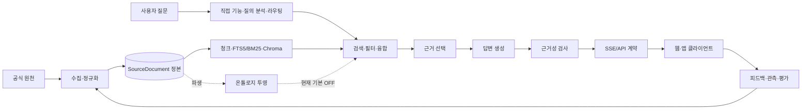

# Dongttok 전체 파이프라인 점검 및 개선 계획

점검 기준일: 2026-09-21

진행 상태(2026-09-22): 수집·정본 영역의 P0/P1/P2는 완료됐다. 공지·과목 dense
정합성, 급식 신선도, staff 승인 갱신, 공지 실패 게시판 재시도와 6개 데이터셋
corpus revision, 원천 구조 fingerprint, revision-bound ontology DAG를 적용했다.
strict lineage 및 Python 테스트 948개가 통과했다.
아래 결론과 감사 스냅샷 수치는 최초 점검 당시의 기준선으로 보존한다.

검색 진행 상태(2026-09-23): 명시적 연락처·과목·학번 질문의 SQL 관계 근거 우선
경로를 스트리밍·비스트리밍 공통 검색 계획에 연결했고, 같은 production shortlist에서
hybrid와 비교하는 구조형/실로그 평가를 마련했다. 구조형 45건은 현재 결정적 라우터에서
예상 데이터셋으로 들어가며 Recall@3 0.896→0.938이지만 사람 판정은 아니다.
실로그 적격 28건 중 후보가 바뀐 17건의 검토 CSV를 만들었다. 다음 게이트는 이
변경을 사람이 판정하고, 교과목을 포함한 최근 질문 표본을 늘리는 것이다. 그 전에는
cross-encoder 및 광범위한 ontology 후보 보강을 켜지 않는다.

## 이어갈 실행 순서 (2026-09-23)

1. **검색 품질 게이트**: 이번 실로그 후보 변경 17건의 추가/제거 문서를 사람이 판정하고, 변경 원인을 별칭·관계·시점·필터·청크로 분류한다. 최근 관계형 질문과 교과목 질문을 모아 데이터셋별 사람 qrels 200건을 만든다. 현재 28건·교과목 0건으로는 승격 판정 불가다.
2. **검색 성능/안전성**: 비교 평가에서 데이터셋별 첫 로딩(아티팩트/모델 포함)을 별도 측정하게 수정했다. warm 상태의 단계별 p50/p95와 첫 요청 비용을 모두 보고, 실제 동시 요청·긴 질문에서 재확인한다. 잘못된 관계 판정이 나오면 해당 route를 즉시 feature flag로 되돌린다.
3. **기존 P1 파이프라인**: 스트리밍/비스트리밍의 검색 계획은 공통화했다. 남은 실행 코어(근거 선택·생성·fallback) 통합 → 단순 질의의 근거 선택 LLM 우회 → 제한 동시성 데이터셋 검색과 단계별 p50/p95 예산 → 공지/교직원 fallback 원인별 보강 순으로 진행한다. 학번별 명시적 기준 등 일부 단순 질의의 분석 LLM 우회는 적용했다. 각 변경은 같은 qrels/골든셋에서 비교한다.
4. **검증 후 확장**: 사람 판정과 실제 endpoint 답변 평가가 통과한 관계형 route만 제한 출시한다. Cross-encoder, 모델/ONNX 변경, 광범위한 온톨로지 후보 보강은 그 다음에 품질·지연·비용을 함께 비교한다.

## 결론

현재 파이프라인은 수집, 정본 저장, 하이브리드 검색, 직접 응답, 근거 선택, 답변 생성, 근거성 검사, SSE 전송, 피드백까지 필요한 구성요소를 대부분 갖췄다. 다만 **지금은 기능을 더 추가하기보다 정본-인덱스 정합성, 데이터 신선도, 회귀 테스트, 운영 측정을 먼저 복구해야 한다.**

출시 판단은 현재 **No-Go**다. 다음 네 가지 P0가 해소되기 전에는 검색 모델 변경, 온톨로지 운영 활성화, 시맨틱 캐시 확대를 보류한다.

1. 공지 Chroma compactor 오류를 복구하고 과목 정본-아티팩트 ID 불일치를 제거한다.
2. 급식 수집의 반복 partial 상태와 최신 로그 단절 원인을 해결한다.
3. 전체 RAG 테스트 3건 실패를 고치고 순서 독립성을 보장한다.
4. 실제 후보 서버 대상 골든 평가를 선택적 skip이 아닌 배포 필수 게이트로 만든다.

## 현재 파이프라인



실제 스트리밍 요청은 위 도식보다 세분화되어 있다. 위기 대응과 WISE 범위 차단이 먼저 실행되고, 과목 추천·스몰토크·미공개 미래 정보·학사일정·급식의 결정적 응답이 일반 RAG보다 앞선다. 이후 대화 이력, 질의 분석, 확장과 라우팅, 날짜·공개범위 필터, 데이터셋별 검색, 후보 균형화, 선택적 재순위화, 근거 선택, 생성, 근거성 검사, 완료 이벤트 순으로 진행된다.

## 감사 스냅샷

| 영역 | 관찰 결과 | 판단 |
|---|---:|---|
| 정본 문서 | 15,944건 | 기반은 충분하나 데이터셋별 신선도 편차가 큼 |
| 검색 청크 | 37,696건 | 규모는 적절하나 공지 dense 저장소 오류와 과목 ID 불일치 존재 |
| 질의 로그 | 3,668건, 마지막 기록 2026-08-29 | 기준일 대비 23일 공백. 현재 운영 판단에 사용할 수 없음 |
| 최근 실트래픽 기준 | 304건, 평균 총 6.69초, fallback 13.8% | 느리고 표본 종료일이 오래됨 |
| 근거성 검사 | 검사된 응답의 grounded 78.7% | 미검사/검사 실패 의미를 분리해야 함 |
| 사용자 피드백 | 6건(긍정 2, 부정 4) | 의사결정 표본으로 부족 |
| RAG 테스트 | 889 통과, 3 실패 | 출시 차단 |
| 프런트 테스트 | 50 통과, lint/build 통과 | 기본 계약은 양호, CI에서 test 미실행 |
| 백엔드 계약 테스트 | 통과 | CI는 실행하지 않고 build만 수행 |
| 온톨로지 | 9,235 엔터티, 9,615 관계, shadow 로그 0 | 구현은 유효하나 운영 근거가 없어 기본 OFF가 맞음 |

최근 실트래픽 수치는 최신 로그 종료일인 2026-08-29를 기준으로 직전 30일을 계산한 것이다. 단계별 평균은 해당 단계를 실제 실행한 요청만 대상으로 하므로 서로 더해 총 시간으로 해석하면 안 된다.

| 실행 단계 | 조건부 평균 |
|---|---:|
| 질의 분석 | 2,655ms |
| 검색·융합 | 500ms |
| 근거 선택 | 1,313ms |
| 생성 | 4,000ms |
| 근거성 검사 | 1,954ms |

## 기능의 필요성 판단

| 기능 | 현재 프로젝트에 필요한가 | 운영 방침 |
|---|---|---|
| `SourceDocument` 정본과 계보 검사 | 반드시 필요 | 가장 먼저 복구하고 모든 파생 인덱스의 기준으로 유지 |
| FTS5/BM25 + dense 하이브리드 검색 | 필요 | 정합성 복구 후 데이터셋별 가중치와 후보 수를 평가로 조정 |
| 일정·급식·과목 추천 직접 응답 | 매우 필요 | 정확하고 빠른 경로이므로 일반 LLM 경로보다 우선 |
| 질의 분석 LLM | 조건부 필요 | 복합·후속·모호 질의에만 사용하고 단순 질의는 우회 |
| LLM 근거 선택 | 조건부 필요 | 충돌하거나 여러 문서를 종합할 때만 사용 |
| 답변 근거성 검사 | 필요 | 실패를 통과로 취급하지 말고 고위험 답변은 전송 전에 검사 |
| 재순위화 모델 | 지금은 선택 | qrels에서 유의미한 개선과 지연 예산을 동시에 증명할 때만 활성화 |
| 시맨틱 캐시 | 지금은 보류 | 코퍼스 revision 기반 무효화와 시의성 안전장치 후 제한 도입 |
| 온톨로지 관계 검색 | 좁은 범위에서 유용 | shadow 평가를 거쳐 관계형 질문에만 후보 보강으로 사용 |
| 별도 그래프 DB·전면 LLM 관계 추출 | 현재 불필요 | 운영 복잡도 대비 입증된 이익이 없음 |

## 권장 실행 순서

### P0 — 출시 차단 해소

- 공지 dense 인덱스를 staged rebuild 또는 정상 포인터로 복구하고 계보 검사를 통과시킨다.
- 과목의 `document_key` 생성 규칙을 하나로 고정한 뒤 정본에서 모든 파생물을 재생성한다.
- 급식 0건 수집을 성공으로 누적하지 말고 원인별 상태·알림·마지막 정상 시각을 노출한다.
- 질의 분석 테스트의 전역 singleton 오염을 제거해 전체·격리·순서 무작위 실행을 모두 통과시킨다.
- 골든 후보 URL 미설정 시 배포를 실패시키고, 프런트/백엔드 계약 테스트를 CI에서 실제 실행한다.

### P1 — 품질과 지연 개선

- 스트리밍/비스트리밍의 중복 오케스트레이션을 하나의 실행 코어로 통합한다.
- 단순 질의의 질의 분석·근거 선택·근거성 LLM 호출을 결정적 경로로 대체한다.
- 데이터셋 검색을 제한된 동시성으로 병렬화하고 p50/p95 단계 예산을 도입한다.
- 공지와 교직원 검색의 높은 fallback을 분류해 별칭, 부서명, 날짜/마감 필터를 보강한다.
- 사용자 피드백과 사람 판정 qrels를 수집해 검색·온톨로지·생성 변경의 회귀 기준으로 사용한다.

### P2 — 검증 후 확장

- 온톨로지 자동 재생성과 shadow 비교를 운영화한 후 제한된 관계형 질의에 후보 보강을 켠다.
- 코퍼스 revision에 묶인 안전한 시맨틱 캐시를 비시의성·단일턴 질의부터 적용한다.
- 재순위화, ONNX 최적화, 모델 교체는 동일 골든셋에서 품질/비용/지연을 함께 비교한 뒤 결정한다.

## 세부 문서

1. [수집·정본·데이터 신선도](01-ingestion-canonical.md)
2. [인덱싱·검색·후보 융합](02-indexing-retrieval.md)
3. [질의 이해·라우팅·직접 기능](03-query-understanding-direct-features.md)
4. [근거 선택·생성·근거성 검사](04-evidence-generation-grounding.md)
5. [온톨로지·관계 검색](05-ontology-relational-retrieval.md)
6. [RAG API·런타임·운영](06-api-runtime-operations.md)
7. [평가·관측·릴리스 게이트](07-evaluation-observability.md)
8. [백엔드 중계·클라이언트 전달](08-client-delivery.md)
9. [청크 표현 품질](09-chunk-representation.md)
10. [원천 대비 수집 완전성](10-source-coverage.md)

## 감사 범위와 재현 명령

이번 점검은 현재 워크트리의 코드, SQLite 정본/로그, Chroma·FTS·모델 아티팩트, CI 정의, Python/프런트/백엔드 계약 테스트를 대상으로 했다. 외부 원천 사이트와 실제 배포 URL은 호출하지 않았다.

```bash
cd src/RAG
.venv311/bin/python -m pytest -q
.venv311/bin/python scripts/report_canonical_lineage.py --mode observe
.venv311/bin/python scripts/report_data_quality.py --dataset notices --mode observe

cd ../RenuxServer/wwwroot/frontend
npm test
npm run lint
npm run build

cd ../..
dotnet run --project Tests/RenuxServer.ContractTests.csproj --configuration Release
```

`npm run build`는 성공 시 `wwwroot` 정적 산출물을 동기화한다. 단순 검증 환경에서는 별도 임시 워크트리나 CI 컨테이너에서 실행하는 편이 안전하다.
